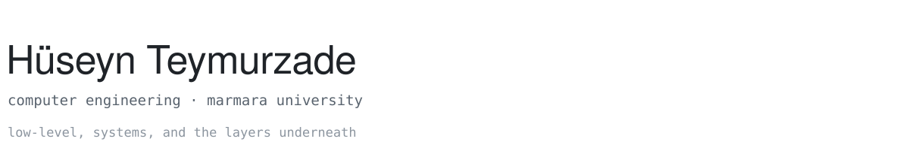
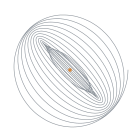

<picture>
  <source media="(prefers-color-scheme: dark)" srcset="assets/line-header-dark.svg">
  
</picture>

I write software close to the machine — allocators, interpreters, emulators —
and terminal programs that are pleasant to live in. Mostly Rust, C, Zig and Go,
on Linux. Computer engineering at Marmara University; open to internships.

<picture>
  <source media="(prefers-color-scheme: dark)" srcset="assets/topo-dark.svg">
  
</picture>
<sub>contour lines over a Perlin field, marching squares, no dependencies — <a href="assets/gen/plot.py">assets/gen/plot.py</a></sub>

### Focus

```
.
├── runtimes/    hand-rolled allocators, a Lisp with real closures, a CHIP-8 — how bytes become behaviour
├── terminal/    TUIs that stay responsive under async I/O; Kitty/Sixel pixels with a half-block fallback; LAN protocols
├── graphics/    Perlin and Worley noise, hillshading, normal maps, a PNG encoder — no crates, on purpose
└── boundaries/  Zig engines behind Python ctypes; CRDT state over WebSockets; shared objects that link nothing
```

### Toolbox

```
systems      C · Rust · Zig · Go
also         Python · TypeScript · Lua · Odin
terminal     Ratatui · Bubbletea · egui · raylib · SDL2
around them  Linux · Neovim · Nix · Git · Docker · PostgreSQL
```

### Elsewhere

[LinkedIn](https://www.linkedin.com/in/hüseyn-teymurzade-9492a92b3) ·
[Email](mailto:huseynteymurrr74@gmail.com) ·
[LeetCode](https://www.leetcode.com/flearlyly) ·
[Codewars](https://www.codewars.com/users/Huseyn%20Teymurzade)

<p align="center">
  <picture>
    <source media="(prefers-color-scheme: dark)" srcset="assets/mark-dark.svg">
    
  </picture>
  <br>
  <sub>Most of this runs in a terminal. Most of the rest wishes it did.</sub>
</p>
