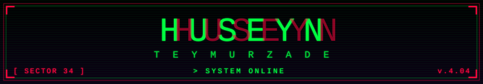

<div align="center">



[](https://github.com/flearlyly)

</div>

---

<div align="center">

### `╳  T R A N S M I S S I O N   I N C O M I N G  ╳`



</div>

---

## `▌ identity`

```c
#include <reality.h>
#include <coffee.h>

typedef struct {
    const char* handle;
    const char* origin;
    const char* shell;
    int         coffees_per_day;
    bool        debugger_attached;
} operator_t;

operator_t self = {
    .handle            = "huso",
    .origin            = "marmara.edu // computer engineering",
    .shell             = "/bin/zsh on arch linux",
    .coffees_per_day   = 0x07,
    .debugger_attached = false,   // i print, therefore i am
};

int main(void) {
    while (alive(self)) {
        learn();
        build();
        break_things();
        fix_things();
    }
    return 42;
}
```

```diff
@@ MISSION BRIEF @@
- comfort zones
- premade solutions
- "it works on my machine"
+ low-level curiosity
+ open source warfare
+ systems that don't suck
+ shipping > perfection
```

---

## `▌ ./run --tech-arsenal`

<div align="center">

**` LANGUAGES `**


**` SYSTEMS & TOOLS `**


</div>

---

## `▌ cat ~/.now`

```rust
// last sync :: dispatch from sector 34

const STATUS: Dispatch = Dispatch {
    learning:    &["lock-free data structures", "OS internals", "compilers"],
    building:    &["personal tooling", "side quests nobody asked for"],
    grinding:    &["leetcode", "codewars", "real systems"],
    available:   Availability::OpenForIntern,
    location:    Location::Istanbul,
};

// "the cake is a lie, but the segfault is real."
```

---

## `▌ ./stats`

<div align="center">


<br/>


</div>

---

## `▌ ./connect`

<div align="center">

[](https://www.linkedin.com/in/hüseyn-teymurzade-9492a92b3)
[](mailto:huseynteymurrr74@gmail.com)
[](https://www.leetcode.com/flearlyly)
[](https://www.codewars.com/users/Huseyn%20Teymurzade)

<br/>

<sub>`signal lost ▒▒▒░░░░░░░  //  end of transmission  //  0xDEADBEEF`</sub>

</div>
