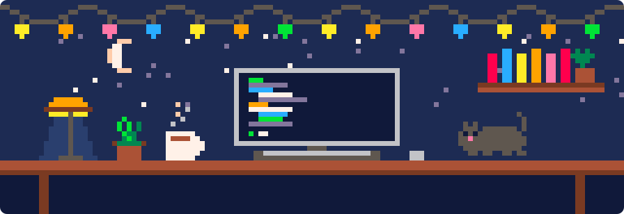
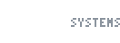
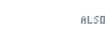
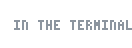
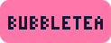
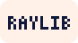
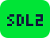

<picture>
  <source media="(prefers-color-scheme: dark)" srcset="assets/line-header-dark.svg">
  
</picture>

I write software close to the machine — allocators, interpreters, emulators —
and terminal programs that are pleasant to live in. Mostly Rust, C, Zig and Go,
on Linux.

<p align="center">
  
</p>

### Focus

```
.
├── runtimes/    hand-rolled allocators, a Lisp with real closures, a CHIP-8 — how bytes become behaviour
├── terminal/    TUIs that stay responsive under async I/O; Kitty/Sixel pixels with a half-block fallback; LAN protocols
├── graphics/    Perlin and Worley noise, hillshading, normal maps, a PNG encoder — no crates, on purpose
└── boundaries/  Zig engines behind Python ctypes; CRDT state over WebSockets; shared objects that link nothing
```

### Toolbox

<p>
  
  <picture>
    <source media="(prefers-color-scheme: dark)" srcset="https://skillicons.dev/icons?i=c%2Ccpp%2Crust%2Czig%2Cgo&theme=dark">
    
  </picture>
</p>
<p>
  
  <picture>
    <source media="(prefers-color-scheme: dark)" srcset="https://skillicons.dev/icons?i=python%2Cts%2Clua%2Cbash&theme=dark">
    
  </picture>
  
</p>
<p>
  
  <picture>
    <source media="(prefers-color-scheme: dark)" srcset="https://skillicons.dev/icons?i=linux%2Cneovim%2Cnix%2Cgit%2Cdocker%2Cpostgres&theme=dark">
    
  </picture>
</p>
<p>
  
  
  
  
  
  
</p>

### Elsewhere

<p>
  <a href="https://www.linkedin.com/in/hüseyn-teymurzade-9492a92b3"></a>&nbsp;&nbsp;
  <a href="mailto:huseynteymurrr74@gmail.com"></a>&nbsp;&nbsp;
  <a href="https://www.leetcode.com/flearlyly"></a>&nbsp;&nbsp;
  <a href="https://www.codewars.com/users/Huseyn%20Teymurzade"></a>
</p>

<sub>Most of this runs in a terminal. Most of the rest wishes it did.</sub>
