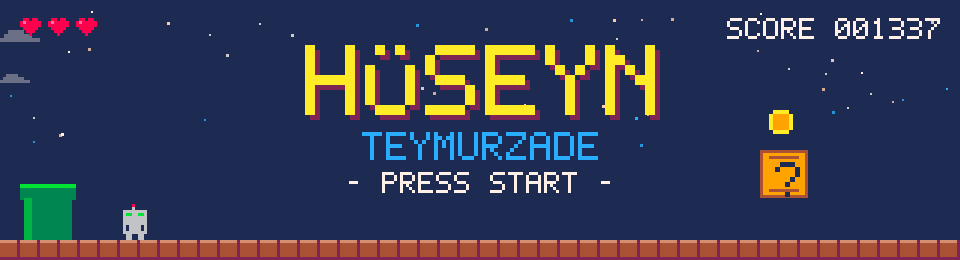
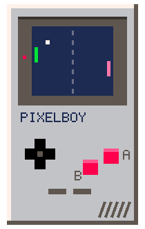
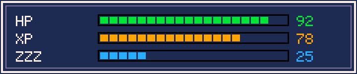
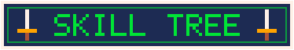
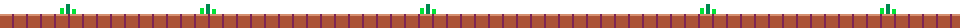
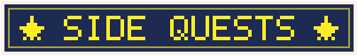
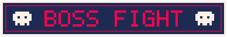
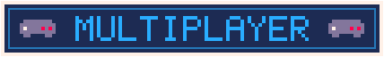
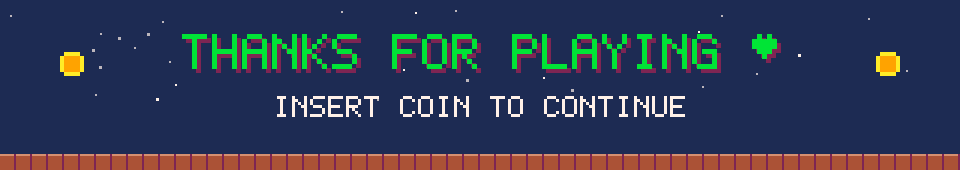

<div align="center">




</div>

<br>



```rust
// save_slot_01.rs
struct Player {
    name:      &'static str,
    class:     &'static str,
    guild:     &'static str,
    alignment: &'static str,
}

const HUSEYN: Player = Player {
    name:      "Hüseyn Teymurzade",
    class:     "Computer Engineering Student",
    guild:     "Marmara University",
    alignment: "chaotic curious",
};

// favorite biome: the linux terminal
// ultimate:  println!() driven debugging
```

<div align="center">






<br><br>

<a href="https://skillicons.dev">
  
</a>

<br><br>



</div>



```rust
struct QuestLog {
    main_quest:  &'static str,
    side_quests: Vec<&'static str>,
    loot_wanted: Vec<&'static str>,
}

fn current_run() -> QuestLog {
    QuestLog {
        main_quest: "become a systems wizard",
        side_quests: vec![
            "grind advanced algorithms   [######--] ",
            "level up system design      [####----] ",
            "open source contributions   [ongoing ] ",
            "leetcode daily boss fights  [respawns] ",
        ],
        loot_wanted: vec!["rare knowledge", "collabs", "cool projects"],
    }
}
```

<div align="center">



<br><br>






<br><br>

[](https://www.linkedin.com/in/hüseyn-teymurzade-9492a92b3)
&nbsp;
[](mailto:huseynteymurrr74@gmail.com)
&nbsp;
[](https://www.leetcode.com/flearlyly)
&nbsp;
[](https://www.codewars.com/users/Huseyn%20Teymurzade)

<br>



</div>
